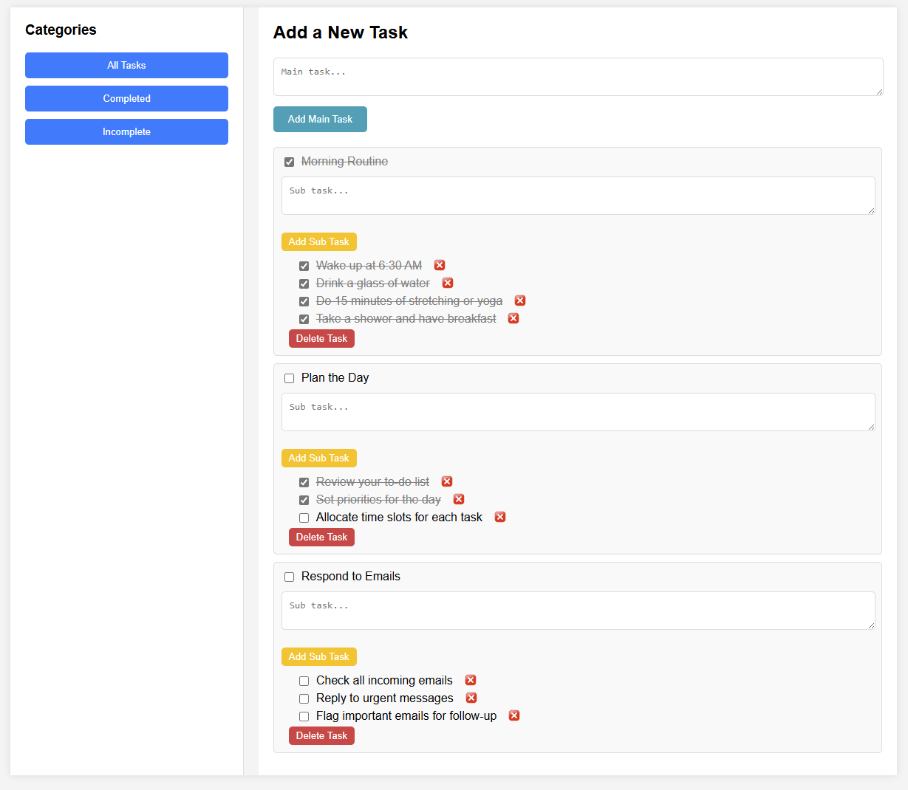

# To-Do List

A simple To-Do List application built with HTML, CSS, and JavaScript. This app allows users to add, delete, and mark tasks as completed, featuring a user-friendly interface.

## Table of Contents

- [Introduction](#introduction)
- [Features](#features)
- [Installation](#installation)
- [Usage](#usage)
- [Folder Structure](#folder-structure)
- [Screenshots](#screenshots)
- [Author](#author)

## Introduction

This To-Do List project was developed as a learning exercise to understand the basics of web development using HTML, CSS, and JavaScript. It provides a straightforward interface where users can manage their tasks effectively.

## Features

- **Add Task**: Users can add new tasks by typing and submitting them.
- **Mark as Completed**: Click on a task to mark it as completed.
- **Delete Task**: Remove tasks from the list when no longer needed.
- **Responsive Design**: Works well on both desktop and mobile devices.

## Installation

1. Clone this repository to your local machine:
   ```bash
   git clone https://github.com/codewt88/todo-list.git
   ```
2. Navigate to the project folder:
   ```bash
   cd todo-list
   ```
3. Open `index.html` in your preferred web browser to start the app.

## Usage

- Enter a task in the input field and press "Add" to include it in the list.
- Click on any task to mark it as completed.
- Press the delete icon next to a task to remove it.

## Folder Structure

```
todo-list/
│
├── index.html         # Main HTML file
├── style.css          # CSS file for styling
└── script.js          # JavaScript file for functionality
```

## Screenshots



## Author

Developed by [CODEWT](https://github.com/codewt88).
